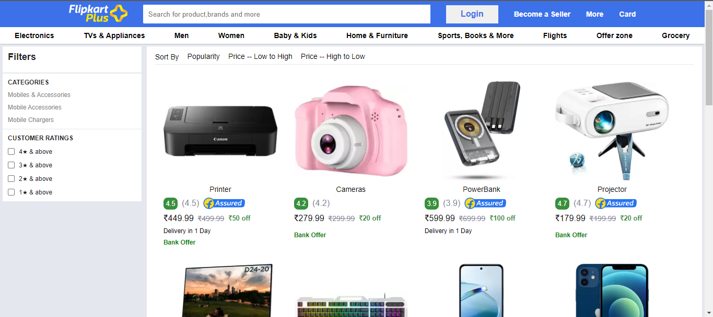
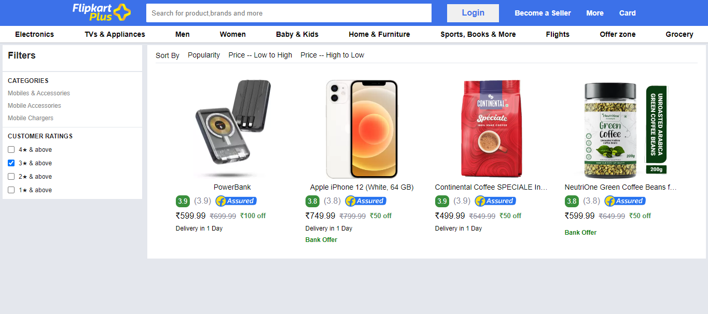

# Flipkart Clone

Welcome to the Flipkart Clone project! This is a replica of the popular e-commerce platform Flipkart, created as a learning project to showcase various features like product listing, sorting, and filtering.

## Table of Contents
- [Demo](#demo)
- [Features](#features)
- [Technologies Used](#technologies-used)
- [UI](#ui)
- [License](#license)

## Demo
👉 [Click Me For Live Demo]()

👉🏻 [Try it here](https://mishra06.github.io/GEEKATHON_TEAM_10/Flipkart_page_by-sonu_kumar/)

## Features
1. **Product Listing:** Display a list of products with details.
2. **Sorting:** Allow users to sort products based on different criteria.
3. **Filtering:** Provide various filters to help users narrow down their product search.
4. **Responsive Design:** Ensure the application works seamlessly on different devices.

## Technologies Used
- HTML
- CSS
- JavaScript

## UI

## License
This project is licensed under the [MIT License](LICENSE).
