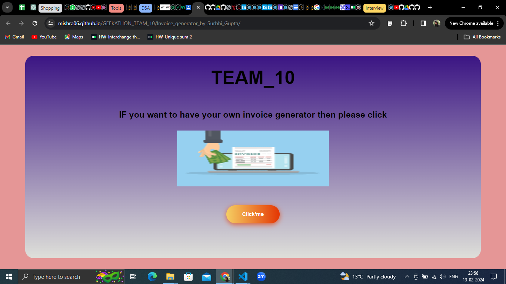
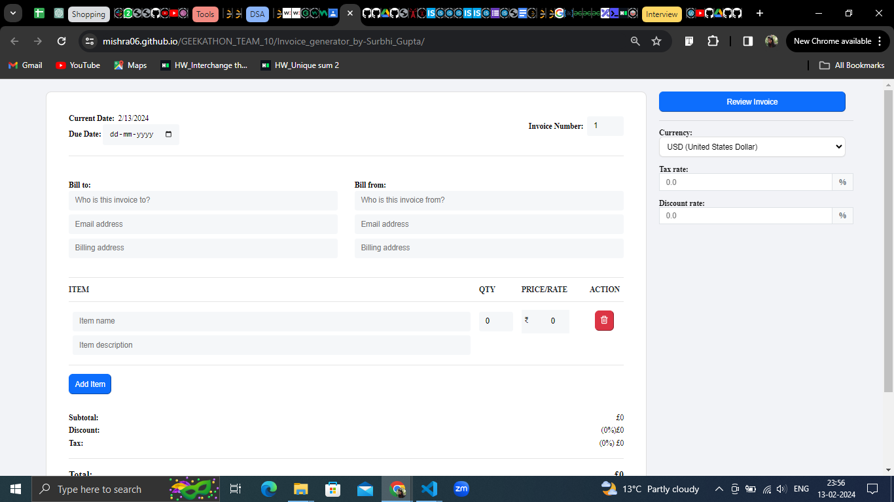
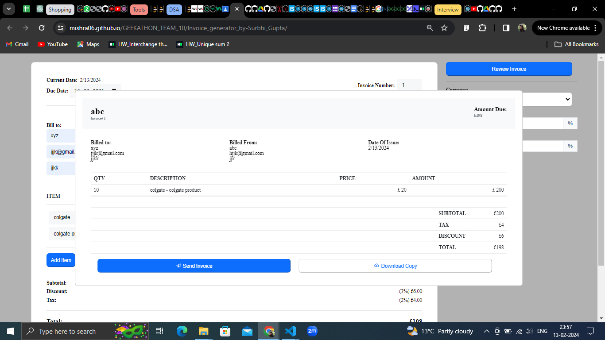

Invoice Generator using HTML, CSS, Javascript

## UI

## Introduction
The Invoice Generator project is a web application designed to streamline the process of creating professional invoices. This application is built using HTML, CSS, and JavaScript to provide a user-friendly interface for generating invoices quickly and efficiently.

Features:-
User-Friendly Interface.
Dynamic Invoice Generation
Automated Calculations
Print and Save Functionality
Download option

## Technologies Used:-
-Javascript - For all the functionalities including add item, delete item, review invoice, download invoice.
-HTML & CSS - For the UI and alingments of invoice generator area buttons and navbar.
-Git - For version control and collaboration

## Demo

Link -https://mishra06.github.io/GEEKATHON_TEAM_10/Invoice_generator_by-Surbhi_Gupta/